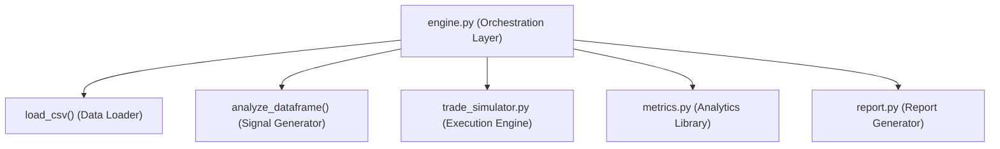
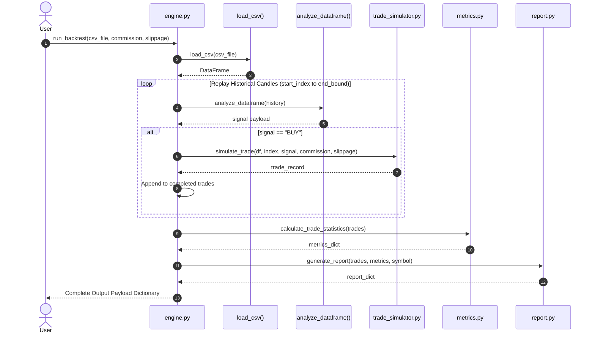

# Backtesting Module Documentation

## Overview

The backtesting module in NEPSE Quant Engine provides a quantitative framework for replaying historical market data, simulating trade executions under configurable market friction (commission and slippage), computing performance statistics, and generating comprehensive backtest reports.

Designed following Clean Architecture principles, the module separates high-level orchestration from execution logic, statistical modeling, and report generation.

---

## Module Architecture

The `src/backtest` package consists of four core modules:



| Module | Responsibility | Primary Symbols |
| :--- | :--- | :--- |
| [`engine.py`](file:///c:/Users/User/Documents/nepse-quant-engine/src/backtest/engine.py) | High-level orchestration of the backtesting workflow. Replays historical data, invokes signal generator and trade simulator, and aggregates metrics and reports. | `run_backtest()`, `backtest()` |
| [`trade_simulator.py`](file:///c:/Users/User/Documents/nepse-quant-engine/src/backtest/trade_simulator.py) | Simulates long trade executions, evaluates candle exit conditions, applies slippage/commission, and builds trade records. | `simulate_trade()`, `TradeExecutionEngine`, `ExecutionConfig`, `TradeRecord`, `ExitReason`, `TradeResult` |
| [`metrics.py`](file:///c:/Users/User/Documents/nepse-quant-engine/src/backtest/metrics.py) | Pure mathematical calculation of portfolio and trade-level performance analytics. | `calculate_trade_statistics()`, `calculate_win_rate()`, `calculate_profit_factor()`, `calculate_expectancy()`, `calculate_sharpe_ratio()`, `calculate_max_drawdown()` |
| [`report.py`](file:///c:/Users/User/Documents/nepse-quant-engine/src/backtest/report.py) | Converts raw trade histories and metrics into structured summary dictionaries and human-readable text overviews. | `generate_report()` |

---

## Execution Flow



### Execution Steps
1. **Data Loading**: `load_csv()` loads historical OHLCV data from the specified CSV file.
2. **Candle Replay Loop**: The engine iterates through historical candles starting at `DEFAULT_START_INDEX` (30) up to `len(df) - FORWARD_SIMULATION_BUFFER` (10 days before end of dataset).
3. **Signal Generation**: At each candle $i$, the historical slice `df.iloc[: i + 1]` is passed to `analyze_dataframe()` to produce indicator scores and trading signals.
4. **Trade Execution**: When a `BUY` signal is generated, `simulate_trade()` evaluates the forward price action in `df` starting at index $i + 1$.
5. **Trade Collection**: Successfully executed trade records are appended to the trade history list.
6. **Metrics Calculation**: Once all historical candles are processed, `metrics.calculate_trade_statistics()` calculates aggregate win rate, profit factor, average win/loss, and trade expectancy.
7. **Report Generation**: `report.generate_report()` formats the completed trade list and metrics into a human-readable text summary and structured report dictionary.
8. **Payload Assembly**: `engine.py` returns a composite dictionary containing `trades`, `metrics`, `report`, `symbol`, `candles`, `total_trades`, and `history`.

---

## Trade Simulator & Execution Mechanics

### Commission & Slippage Models
- **Commission**: Applied as a per-side decimal percentage (e.g. `0.001` for 0.1%). Commission is charged on both entry and exit:
  $$\text{commission\_paid} = (\text{entry\_price} + \text{exit\_price}) \times \text{shares} \times \text{commission\_rate}$$
- **Slippage**: Applied as a per-side adverse price adjustment decimal fraction (e.g. `0.01` for 1%):
  - **Entry (Long)**: Price is adjusted upwards (adverse):
    $$\text{entry\_price} = \text{signal\_price} \times (1 + \text{slippage})$$
  - **Exit**: Price is adjusted downwards (adverse):
    $$\text{exit\_price} = \text{trigger\_price} \times (1 - \text{slippage})$$

### Exit Conditions & Priority Order
For each forward candle $j \in [start\_index + 1, final\_index]$, the simulator evaluates exit rules in conservative priority order:

1. **`STOP_LOSS`**: Triggered if `Low` $\le$ `stop_loss`. Exit price set to `stop_loss * (1 - slippage)`.
2. **`TARGET`**: Triggered if `High` $\ge$ `target1`. Exit price set to `target1 * (1 - slippage)`.
3. **`SELL_SIGNAL`**: Triggered if candle contains a `SELL` signal. Exit price set to `Close * (1 - slippage)`.
4. **`END_OF_DATA`**: Triggered if maximum holding period (`MAX_HOLDING_DAYS` = 10) or dataset end is reached without hitting target or stop loss. Exit price set to final candle `Close * (1 - slippage)`.

> [!IMPORTANT]
> **Stop Loss Precedence**: If a candle reaches both the stop loss and target levels, the simulator conservatively triggers the `STOP_LOSS` exit first.

### Profit & Loss Formulas
- **Gross Profit**:
  $$\text{gross\_profit} = (\text{exit\_price} - \text{entry\_price}) \times \text{shares}$$
- **Net Profit**:
  $$\text{net\_profit} = \text{gross\_profit} - \text{commission\_paid}$$
- **Return Percentage**:
  $$\text{return\_pct} = \frac{\text{net\_profit}}{\text{entry\_price} \times \text{shares}} \times 100$$
- **Holding Period**:
  $$\text{holding\_days} = \text{exit\_index} - \text{start\_index}$$

---

## Output Data Dictionary Reference

### 1. Trade Record Fields
Each trade dictionary in `trades` / `history` contains the following fields:

| Field Name | Type | Description |
| :--- | :--- | :--- |
| `entry_price` | `float` | Executed long entry price rounded to 2 decimals (includes adverse entry slippage). |
| `exit_price` | `float` | Executed exit price rounded to 2 decimals (includes adverse exit slippage). |
| `shares` | `int` | Position size in number of shares traded. |
| `gross_profit` | `float` | Unadjusted price profit/loss $(\text{exit\_price} - \text{entry\_price}) \times \text{shares}$. |
| `commission` | `float` | Total round-trip commission paid. |
| `net_profit` | `float` | Net profit after deducting commission. |
| `return_pct` | `float` | Net return as a percentage of initial entry capital value. |
| `holding_days` | `int` | Duration trade was open in candles/days. |
| `exit_reason` | `str` | Category of exit: `"TARGET"`, `"STOP_LOSS"`, `"SELL_SIGNAL"`, or `"END_OF_DATA"`. |
| `result` | `str` | Legacy outcome classification: `"WIN"`, `"LOSS"`, `"SELL"`, or `"TIME_EXIT"`. |
| `date` | `str` | ISO date string of entry signal candle. |
| `symbol` | `str` | Symbol or file path identifier. |

### 2. Metrics Output Fields
The `metrics` dictionary contains aggregate performance statistics:

| Metric Key | Type | Description |
| :--- | :--- | :--- |
| `total_trades` | `int` | Total count of executed trades. |
| `winning_trades` | `int` | Count of trades with `return_pct > 0`. |
| `losing_trades` | `int` | Count of trades with `return_pct < 0`. |
| `breakeven_trades` | `int` | Count of trades with `return_pct == 0`. |
| `win_rate` | `float` | Percentage of winning trades $(\text{winning\_trades} / \text{total\_trades}) \times 100$. |
| `profit_factor` | `float` | Ratio of gross winning returns to absolute gross losing returns. |
| `average_win` | `float` | Mean positive return percentage across winning trades. |
| `average_loss` | `float` | Mean negative return percentage across losing trades. |
| `expectancy` | `float` | Expected return percentage per trade across all executed trades. |

### 3. Report Output Fields
The `report` dictionary contains formatted summaries:

| Report Key | Type | Description |
| :--- | :--- | :--- |
| `symbol` | `str` | Target stock symbol or file path identifier. |
| `summary` | `str` | Multiline formatted text report suitable for printing or logging. |
| `total_trades` | `int` | Total completed trades count. |
| `winning_trades` | `int` | Count of winning trades. |
| `losing_trades` | `int` | Count of losing trades. |
| `win_rate` | `float` | Win rate percentage rounded to 2 decimals. |
| `profit_factor` | `float` | Profit factor rounded to 2 decimals. |
| `expectancy` | `float` | Expectancy percentage rounded to 2 decimals. |

### 4. Engine Output Payload
The main `run_backtest()` function returns a composite dictionary:

| Key | Type | Description |
| :--- | :--- | :--- |
| `symbol` | `str` | Path or name of CSV data file. |
| `candles` | `int` | Total historical candles in dataset. |
| `total_trades` | `int` | Total trades executed during backtest. |
| `trades` | `list[dict]` | Full list of trade record dictionaries. |
| `metrics` | `dict` | Calculated performance metrics dictionary. |
| `report` | `dict` | Report output dictionary containing summary text. |
| `history` | `list[dict]` | Backward-compatible alias referencing `trades`. |

---

## Example Usage

### 1. Running a Full Backtest
```python
from src.backtest.engine import run_backtest

# Execute backtest with 0.1% commission and 0.5% slippage
results = run_backtest(
    csv_file="data/raw/nabbc.csv",
    commission=0.001,
    slippage=0.005,
    start_index=30,
)

print(f"Symbol       : {results['symbol']}")
print(f"Candles      : {results['candles']}")
print(f"Total Trades : {results['total_trades']}")

# Print formatted summary report text
print("\n" + results["report"]["summary"])

# Inspect calculated metrics
metrics = results["metrics"]
print(f"Win Rate      : {metrics['win_rate']:.2f}%")
print(f"Profit Factor : {metrics['profit_factor']:.2f}")
print(f"Expectancy    : {metrics['expectancy']:.2f}%")
```

### 2. Direct Trade Simulation
```python
import pandas as pd
from src.backtest.trade_simulator import simulate_trade

# Sample market data DataFrame
data = pd.DataFrame([
    {"High": 100, "Low": 99, "Close": 100},
    {"High": 112, "Low": 98, "Close": 110},
])

signal = {
    "signal": "BUY",
    "price": 100.0,
    "stop_loss": 95.0,
    "target1": 110.0,
    "shares": 100,
}

trade = simulate_trade(
    df=data,
    start_index=0,
    signal=signal,
    commission=0.001,
    slippage=0.01,
)

if trade:
    print(f"Exit Reason : {trade['exit_reason']}")
    print(f"Entry Price : {trade['entry_price']}")
    print(f"Exit Price  : {trade['exit_price']}")
    print(f"Net Profit  : Rs. {trade['net_profit']}")
```

---

## Current Limitations

1. **Long-Only Trading**: The engine currently supports long entry execution (`BUY` signals) and does not support short selling or multi-leg option strategies.
2. **Single-Position Execution**: Replays run single isolated trades per signal without compound position scaling, pyramid entries, or partial take-profit exits.
3. **Static Friction Model**: Commission and slippage use fixed decimal rates and do not simulate dynamic order book liquidity, bid-ask spreads, or market impact for large order sizes.
4. **Intraday Execution Simplification**: High/Low levels are evaluated sequentially per candle without tick-level execution timestamps (e.g. intra-candle order of High vs Low is approximated via conservative stop loss precedence).
5. **Nepse Specific Fee Model**: Charges use a uniform commission rate rather than NEPSE-specific tiered broker fee schedules, SEBON fees, DP charges, and capital gains tax rules.

---

## Future Improvements

1. **Nepse Broker & Regulatory Fee Engine**: Implement exact NEPSE tiered broker commission tiers (0.40%–0.27%), SEBON transaction fee (0.015%), DP fee (Rs. 25), and Capital Gains Tax (5%/7.5%).
2. **Multi-Asset Portfolio Manager**: Support concurrent backtesting across multiple symbols with dynamic portfolio risk allocation, cash balancing, and equity curve tracking.
3. **Advanced Trade Management**: Add partial take-profit targets (Target 1, Target 2, Target 3), trailing stop-loss adjustments, and dynamic position sizing strategies (Kelly Criterion, Fixed Fractional).
4. **Parameter Optimization & Walk-Forward Testing**: Build grid search and walk-forward optimization routines to evaluate indicator robustness across out-of-sample periods.
5. **Interactive Visualization**: Generate visual HTML charts displaying price series, trade entry/exit markers, drawdown curves, and monthly return heatmaps.