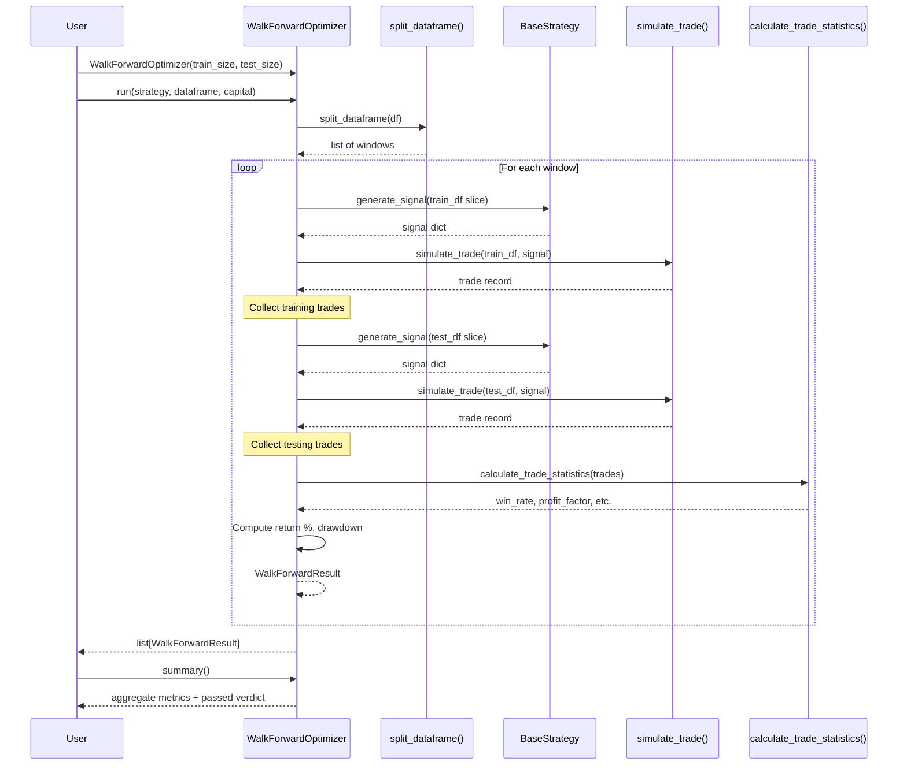

# Walk-Forward Optimisation Module

## Overview

The Walk-Forward Optimisation Engine evaluates whether a trading strategy remains profitable on **unseen data** by repeatedly training on one historical window and testing on the next rolling window.

This technique helps detect **overfitting** — a strategy that performs well on historical data but fails on new data will show a large discrepancy between training and testing performance.

---

## Architecture

```
┌──────────────────────────────────────────────────────┐
│                  WalkForwardOptimizer                │
│                                                      │
│  ┌─────────────┐  ┌──────────────┐  ┌────────────┐ │
│  │split_       │  │   run()      │  │  summary() │ │
│  │dataframe()  │  │              │  │            │ │
│  └──────┬──────┘  └──────┬───────┘  └─────┬──────┘ │
│         │                │                 │        │
│         ▼                ▼                 ▼        │
│  ┌──────────────┐  ┌──────────────┐  ┌──────────┐  │
│  │ Rolling      │  │  Per-window  │  │ Aggregate │  │
│  │ Windows      │  │  Backtest    │  │ Metrics   │  │
│  └──────────────┘  └──────┬───────┘  └──────────┘  │
└───────────────────────────┼────────────────────────┘
                            │
            ┌───────────────┼───────────────┐
            ▼               ▼               ▼
    ┌────────────┐  ┌──────────────┐  ┌──────────────┐
    │ BaseStrategy│  │ simulate_   │  │ calculate_   │
    │ .generate_ │  │ trade()     │  │ trade_       │
    │ signal()   │  │             │  │ statistics() │
    └────────────┘  └──────────────┘  └──────────────┘
         src/           src/backtest/     src/backtest/
      strategies/      trade_simulator     metrics
```

### Module Structure

| Module | Responsibility | Primary Symbols |
| :--- | :--- | :--- |
| `walk_forward.py` | Rolling window generation, per-window backtesting, aggregate summary computation | `WalkForwardOptimizer`, `WalkForwardResult` |

---

## Workflow



### Execution Steps

1. **Initialisation**: Create the optimiser with `train_size`, `test_size`, and optional `step_size`.
2. **Window Generation**: `split_dataframe()` divides the DataFrame into rolling train/test windows.
3. **Per-Window Backtest**: For each window:
   - Run `strategy.generate_signal()` on each candle of the **training** slice → simulate trades → collect metrics
   - Run the same strategy on the **testing** slice → simulate trades → collect metrics
   - Compare training vs testing performance → determine if the window **passed**
4. **Aggregation**: `summary()` averages across all windows and computes a consistency score.

---

## Window Splitting Strategy

Windows are generated with a **rolling** approach:

```
Window 1:  train [0 .. train_size-1]         test [train_size .. train_size+test_size-1]
Window 2:  train [step .. step+train_size-1] test [step+train_size .. step+train_size+test_size-1]
Window 3:  train [2*step .. 2*step+train_size-1]  test [2*step+train_size .. 2*step+train_size+test_size-1]
...
```

When `step_size == test_size`, windows are **non-overlapping** (each test period is tested exactly once). When `step_size < test_size`, windows **overlap** (more windows but each test row appears in multiple evaluations).

### Example

With `train_size=100`, `test_size=20`, `step_size=20`:

```
Window 1: train=[0:100]  test=[100:120]
Window 2: train=[20:120] test=[120:140]
Window 3: train=[40:140] test=[140:160]
...
```

---

## Data Format

### Input DataFrame

The DataFrame must contain OHLCV columns: `Open`, `High`, `Low`, `Close`, `Volume`. A `Date` column or datetime index is recommended but not required.

### Output WalkForwardResult

Each window produces a `WalkForwardResult` dataclass:

| Field | Type | Description |
| :--- | :--- | :--- |
| `window_number` | `int` | 1-based window index |
| `train_start` | `int` | First training row index |
| `train_end` | `int` | Last training row index |
| `test_start` | `int` | First testing row index |
| `test_end` | `int` | Last testing row index |
| `training_return` | `float` | Training period total return % |
| `testing_return` | `float` | Testing period total return % |
| `training_win_rate` | `float` | Training period win rate % |
| `testing_win_rate` | `float` | Testing period win rate % |
| `training_profit_factor` | `float` | Training period profit factor |
| `testing_profit_factor` | `float` | Testing period profit factor |
| `training_drawdown` | `float` | Training period max drawdown % |
| `testing_drawdown` | `float` | Testing period max drawdown % |
| `passed` | `bool` | Whether this window met pass criteria |

### Summary Output

`summary()` returns a dictionary:

| Key | Type | Description |
| :--- | :--- | :--- |
| `windows` | `int` | Total windows evaluated |
| `average_training_return` | `float` | Mean training return % |
| `average_testing_return` | `float` | Mean testing return % |
| `average_training_win_rate` | `float` | Mean training win rate % |
| `average_testing_win_rate` | `float` | Mean testing win rate % |
| `best_window` | `int` | Window with highest testing return |
| `worst_window` | `int` | Window with lowest testing return |
| `consistency_score` | `float` | Quality score (0–100) |
| `consistency_label` | `str` | Qualitative label |
| `passed` | `bool` | Overall pass/fail verdict |

---

## Consistency Score

The consistency score measures how well the testing performance **maintains** the training performance.

### Formula

For each window $i$:

```
ratio_i = (testing_return_i / training_return_i) × 100
```

Clamped to $[0, 100]$.

The final consistency score is the average of all `ratio_i` values across windows.

If `training_return_i <= 0` but `testing_return_i > 0`, the ratio is set to `100` (the strategy discovered profitability on unseen data, which is surprisingly good). If both are zero or negative, the ratio is `0`.

### Interpretation

| Score Range | Label | Implication |
| :--- | :--- | :--- |
| 90–100 | **Excellent** | Testing performance closely tracks training — robust strategy |
| 75–89 | **Good** | Minor degradation — strategy is likely robust |
| 50–74 | **Average** | Moderate degradation — some overfitting may be present |
| < 50 | **Likely overfit** | Significant performance drop — strategy likely overfit |

---

## Pass / Fail Verdict

The overall verdict (`passed`) is **True** only when **all three** conditions are met:

| Condition | Threshold | Reason |
| :--- | :--- | :--- |
| Average testing return | > 0% | Strategy must be profitable on unseen data |
| Average testing win rate | > 50% | More than half of test trades must win |
| Consistency score | > 70% | Testing must maintain at least 70% of training performance |

### Per-Window Pass / Fail

Each window's `passed` field is **True** when **both** conditions are met for that single window:

| Condition | Threshold |
| :--- | :--- |
| Testing return | > 0% |
| Testing win rate | > 50% |

---

## Usage Examples

### 1. Basic Walk-Forward Analysis

```python
import pandas as pd
from src.strategies.momentum import MomentumStrategy
from src.optimization.walk_forward import WalkForwardOptimizer

# Load data
df = pd.read_csv("data/raw/nabbc.csv", index_col=0, parse_dates=True)

# Create optimizer
optimizer = WalkForwardOptimizer(
    train_size=200,   # 200 candles for training
    test_size=50,     # 50 candles for testing
    step_size=50,     # non-overlapping windows
)

# Run walk-forward
strategy = MomentumStrategy()
results = optimizer.run(strategy, df, initial_capital=1_000_000)

# Print per-window results
for r in results:
    print(
        f"Window {r.window_number}: "
        f"train={r.training_return:+.2f}% "
        f"test={r.testing_return:+.2f}% "
        f"WR={r.testing_win_rate:.1f}% "
        f"{'✅' if r.passed else '❌'}"
    )

# Print summary
summary = optimizer.summary()
print(f"\nSummary:")
print(f"  Windows: {summary['windows']}")
print(f"  Avg Test Return: {summary['average_testing_return']:+.2f}%")
print(f"  Avg Test Win Rate: {summary['average_testing_win_rate']:.1f}%")
print(f"  Consistency: {summary['consistency_score']:.1f} ({summary['consistency_label']})")
print(f"  Overall: {'✅ PASS' if summary['passed'] else '❌ FAIL'}")
```

### 2. Overlapping Windows

```python
optimizer = WalkForwardOptimizer(
    train_size=200,
    test_size=50,
    step_size=25,  # 50% overlap between consecutive windows
)
results = optimizer.run(strategy, df, initial_capital=1_000_000)
```

### 3. Single-Window Analysis

```python
optimizer = WalkForwardOptimizer(
    train_size=300,
    test_size=100,
)
windows = optimizer.split_dataframe(df)
# windows will have 1 entry if df has exactly 400 rows
```

### 4. Custom Strategy

```python
from src.strategies.breakout import BreakoutStrategy

strategy = BreakoutStrategy(lookback_period=15)
optimizer = WalkForwardOptimizer(train_size=200, test_size=50)
results = optimizer.run(strategy, df, initial_capital=1_000_000)
```

---

## Example Output

### Per-Window Results

```json
[
    {
        "window_number": 1,
        "train_start": 0,
        "train_end": 199,
        "test_start": 200,
        "test_end": 249,
        "training_return": 12.45,
        "testing_return": 8.32,
        "training_win_rate": 62.5,
        "testing_win_rate": 57.14,
        "training_profit_factor": 2.35,
        "testing_profit_factor": 1.92,
        "training_drawdown": 3.21,
        "testing_drawdown": 4.57,
        "passed": true
    },
    {
        "window_number": 2,
        "train_start": 50,
        "train_end": 249,
        "test_start": 250,
        "test_end": 299,
        "training_return": 10.88,
        "testing_return": 5.61,
        "training_win_rate": 60.0,
        "testing_win_rate": 52.94,
        "training_profit_factor": 2.1,
        "testing_profit_factor": 1.45,
        "training_drawdown": 4.12,
        "testing_drawdown": 5.89,
        "passed": true
    }
]
```

### Summary Output

```json
{
    "windows": 2,
    "average_training_return": 11.67,
    "average_testing_return": 6.97,
    "average_training_win_rate": 61.25,
    "average_testing_win_rate": 55.04,
    "best_window": 1,
    "worst_window": 2,
    "consistency_score": 59.38,
    "consistency_label": "Average",
    "passed": false
}
```

---

## Error Handling

| Scenario | Behaviour |
| :--- | :--- |
| **DataFrame too small** | `split_dataframe()` returns empty list; `run()` returns empty list |
| **Empty DataFrame** | No windows generated; `summary()` returns zeroed metrics |
| **Invalid parameters** | `ValueError` raised in constructor |
| **Strategy failure on a window** | Exception caught, logged; window result stored with `passed=False` |
| **Empty results** | `summary()` returns zeroed metrics with `passed=False` |
| **Zero initial capital** | Return % correctly returns `0.0` (safe division) |

---

## Limitations

1. **Single-strategy evaluation**: The engine tests one `BaseStrategy` at a time. Multi-strategy portfolio walk-forward is not supported.
2. **Fixed starting index**: The internal backtest loop uses a hardcoded `DEFAULT_START_INDEX` (30) for indicator warmup, which may not suit all strategies.
3. **No parameter optimisation**: The engine evaluates a strategy as-is. It does not re-fit parameters on each training window.
4. **Simple trade simulation**: Uses the engine's `simulate_trade()` with fixed commission (0.1%) and slippage (0.5%). These cannot currently be overridden per window.
5. **Return-based metrics**: Uses simple `(total_pnl / capital) × 100` rather than compound returns or risk-free rate adjustments.

---

## Future Improvements

1. **Parameter re-fitting**: Automatically optimise strategy parameters on each training window before testing.
2. **Multiple strategy support**: Evaluate and rank several strategies in a single walk-forward run.
3. **Customisable friction**: Allow per-window commission and slippage configuration.
4. **Annualised metrics**: Add CAGR, annualised Sharpe, and annualised volatility per window.
5. **Visualisation helpers**: Generate equity curve comparison charts for best/worst windows.
6. **Purged walk-forward**: Implement purged k-fold cross-validation to prevent data leakage.
7. **Monte Carlo walk-forward**: Combine walk-forward with Monte Carlo resampling for confidence intervals.
